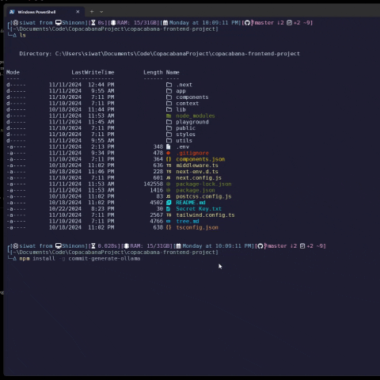
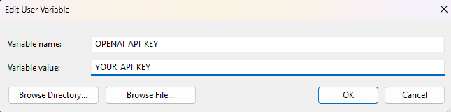

# Git Commit Message Generator with Ollama

## Github

[commit-generate-ollama](https://github.com/Shinon2023/commit-generate-ollama)

## Overview

This Node.js script automatically generates concise and meaningful Git commit messages using AI models from Ollama. It fetches changes in your Git repository, creates a summary of the changes, and generates an appropriate commit message based on those changes. The script also supports model customization, allowing you to choose which Ollama models or Openai models to use for generating the commit messages.

## Features

- **Automatic Git Staging**: Automatically stages files in the working directory before generating the Git diff, ensuring that the commit message reflects all changes.
- **AI-Powered Commit Message Generation**: Uses Ollama's AI models to generate concise commit messages based on the detected changes in your repository.
- **Customizable Model Selection**: Supports specifying different AI models via a command-line argument, allowing you to choose the model that best suits your needs.

## Prerequisites

Before using the script, make sure you have the following installed:

- **Node.js** (v16 or above)
- **npm** (Node Package Manager)
- **Git** (Git version control system) installed and initialized in your project
- **Ollama CLI** with access to the required AI models (e.g., `llama3.1:8b`, `llama3.2-vision:90b`)
- **Openai Api Key** (Optional) if you want to use gpt to generate git commit.

You can download Ollama from [here](https://ollama.com/).
You can get Openai Api Key from [here](https://platform.openai.com/api-keys)

## Preview


## Installation Ollama

### Step 1: Install Dependencies

Make sure you have Node.js and npm installed. Then, install the necessary dependencies by running the following command:

```bash
npm install -g commit-generate-ollama
```

### Step 2: Install Ollama

Follow the instructions on the [Ollama website](https://ollama.com/) to install the Ollama CLI and set up the required models.

#### Recommend

if you install ollama I recommend that if you want to use any ai for the first time, run (optional if you want to use default model) :

```bash
ollama run llama3.1:8b
```

first so that you don't have to wait long while commit-generate-ollama is running and you can track the download status.

You can find more available models on the [Ollama Library](https://ollama.com/library?sort=popular).

```bash
ollama run <Your ai model you want to use>
```

### Step 3: Ensure Git is Initialized

Make sure you have initialized a Git repository in your project directory. You can check this by running:

```bash
git status
```

If your project isn't initialized with Git, you can do so by running:

```bash
git init
```
## Installation Openai Api Key

### Set your api key in your system ENV

Press Windows + s type 

```bash
Edit the system environment variables
```

Go to Environment variables...

In User variables for <Your Usename> press New and type this in variables name :



### Recommend to restart your pc.

## Usage

Usage: commit-generator [options]

Generate commit messages using AI models

Options:
  -d, --debug                output extra debugging
  -p, --provider <provider>  set AI provider (ollama or openai) (default: "ollama")
  -m, --model <model>        set model name
  -h, --help                 display help for command

```bash
commit-generate -p [Provider] -m [modelName]
```

## Examples

### 1. Using the Default Model (`llama3.2`)

To generate a commit message using the default provider (`ollama`) and model (`llama3.2`), simply run:

```bash
commit-generate
```

### 2 Using other Ai provider

To use a different Provider Ai, such as `openai`, run:

```bash
commit-generate -p openai -m gpt-40-mini
```

### 3. Using a Specific Model

To use a different Ollama model, such as `llama3.2-vision:90b`, run:

```bash
commit-generate -m llama3.2-vision:90b
```

You can find more available models on the [Ollama Library](https://ollama.com/library?sort=popular).

## How It Works

The script operates in the following sequence:

1. **Stage All Changes**: It runs `git add .` to stage all the changes in your working directory, ensuring that the changes are tracked.
2. **Fetch Git Diff**: It retrieves the Git diff for all staged changes using `git diff --cached`, which gives a summary of all changes.
3. **Generate Commit Message**: It sends the Git diff to an AI model (from Ollama) via a temporary file to generate a concise and meaningful commit message. The AI model is instructed not to include any code, comments, or suggestions, and only return the commit message.
4. **Display the Commit Message**: After receiving the response from Ollama, the commit message is displayed in the terminal.
5. **Stop the Model**: After generating the commit message, the Ollama model is stopped to free up resources.

## Key Functions

### `getGitDiff`

This function stages all changes and fetches the Git diff for those changes. It ensures that the script works with the most recent changes, whether they are in the staging area or the working directory.

### `callOllamaFromFile`

This function sends the Git diff to Ollama using a temporary file, which serves as input to the AI model. The AI model generates a concise commit message in response.

### `generateCommitMessage`

This is the main function of the script. It coordinates the staging of changes, fetching the diff, and calling the AI model to generate the commit message.

## Troubleshooting

If you encounter issues while running the script, try the following steps:

1. **Ensure Git is Initialized**: Make sure your project is a Git repository by running `git status`.
2. **Check Ollama Model Availability**: Verify that the AI model you specified is available and can be accessed by Ollama.
3. **Ensure Changes Exist**: The script requires there to be changes to commit. If no changes are present in the repository, it will not be able to generate a commit message.
4. **Model Issues**: If you experience issues with the Ollama model, check for any model-specific limitations or errors in the Ollama documentation.

## Modifying the Script

If you'd like to modify the default AI model or change the prompt used to generate commit messages, you can do so by editing the script file located at:

```
C:\Users\<Your Username>\AppData\Roaming\npm\node_modules\commit-generate-ollama\index.js
```

You can update the default model name or customize the prompt according to your preferences.

## How to delete ollama ai-model

You can go to

```
C:\Users\<Your Username>\.ollama\models\blobs
```

you can delete the model as you wish.

## Contributing

Feel free to fork the repository, submit issues, and create pull requests. Contributions are welcome!

## License

This project is licensed under the MIT License - see the [LICENSE](LICENSE) file for details.
